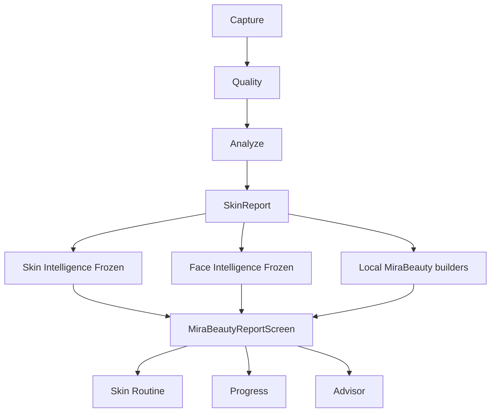

# PHASE 8A — Current-State Architecture Map

## Structural defects
1. No Result Projection Layer — UI binds intelligence + local builders directly.  
2. Single scroll mixes IA categories A–J.  
3. Multiple priority sources (Skin, Journey, Concerns).  
4. Map is illustrative association (`ReportFaceMapSpec`), not pixel evidence.  
5. Advisor entry at end of fatigue path.
