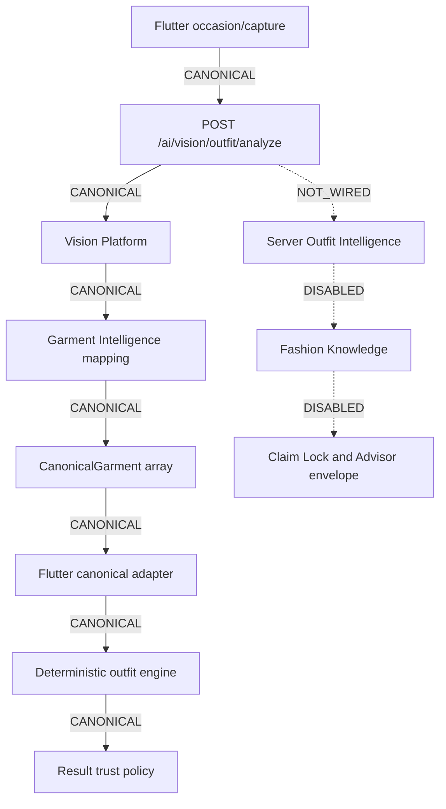

# Phase 1 — Fashion Runtime Graph

## Canonical capture route

The canonical route for image capture ends at the existing trusted Flutter
analysis result. This phase does not claim that server OI or Fashion Knowledge
is part of that hot path.

## Coexisting paths

| Entry / edge | Classification | Production behavior |
|---|---|---|
| `/ai/vision/outfit/analyze` | CANONICAL | Vision → GI → canonical garments |
| `/ai/outfit-segmentation` | CANONICAL support | trusted pixel contours |
| `/ai/outfit-analysis` | LEGACY | mock provider is rejected in production |
| `OUTFIT_PROVIDER=mock` | MOCK / DISABLED | cannot return synthetic production success |
| `FASHION_PROVIDER=vision_platform` | CANONICAL | provider-port entry |
| `FashnOutfitProvider` mock fallback | LEGACY / FALLBACK | outside canonical route |
| server Outfit Intelligence | NOT_WIRED | not in canonical analyze response |
| Fashion Knowledge Mode A | DISABLED | registry disabled and empty |
| Fashion Knowledge Mode B | DISABLED | entitlement and FK flags off |
| Claim Lock | CANONICAL | mandatory whenever FK executes |
| `/advisor/chat` Fashion | CANONICAL but DISABLED | gated by context and activation authorities |
| MCE Fashion advice | BYPASS quarantined | prescriptive Fashion is blocked |

## Honest failure

- Invalid/missing canonical garments fail closed.
- `analysisGate=blocked` is exposed as unavailable, not converted to a score.
- Missing trusted segmentation blocks the result instead of inventing geometry.
- `USE_MIRA_API=false` no longer grants a local synthetic legacy result through
  `OutfitAnalysisRepositoryImpl`.

## Frozen boundaries

No GI/OI/FK engine, public backend contract, Claim Lock gate, or Advisor
evidence law was changed.
