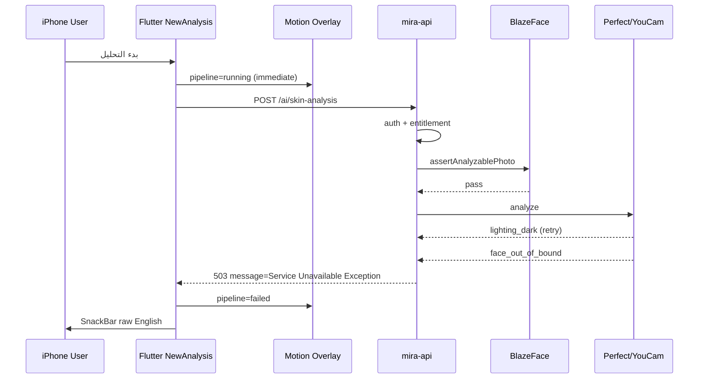

# PHASE 5 — FACE ANALYSIS REAL DEVICE INCIDENT

**Task:** `MIRA-P5-FACE-ANALYSIS-FORENSIC-2026-09-07`  
**Mode:** DIAGNOSIS ONLY — NO REMEDIATION PERFORMED  
**Date:** 2026-09-07  
**Scope:** Face Analysis / Skin analysis journey on physical iPhone → production

---

## 0. Verdict summary

| Field | Value |
|-------|-------|
| FORENSIC VERDICT | **DEFECT CONFIRMED** |
| PRIMARY TECHNICAL ROOT CAUSE | Perfect Corp / YouCam provider rejection after retries (`error_lighting_dark` → final `error_src_face_out_of_bound`), mapped to HTTP **503** via `ServiceUnavailableException(toClientProviderError(...))` |
| USER-VISIBLE STRING ROOT | Nest `HttpExceptionFilter` falls back to class-name message **"Service Unavailable Exception"** because provider client payload has `safeUserMessageKey` but **no** `message` string |
| CLASSIFICATION | **PROVIDER_FAILURE** (primary) + **CONTRACT_MISMATCH** (error surface) + **CLIENT_STATE_DEFECT** (motion before acceptance) |
| PHASE 5 IMPACT | **BLOCKED** for Face/Skin journey acceptance (P5-BLOCKER) |
| REMEDIATION | **NONE** (forbidden this task) |

---

## 1. Exact journey (source)

```
Capture (FaceCapturePanel / camera)
  → local face mesh / Capture Mirror guidance (optional)
  → still validation (FaceGateValidator / quality)
  → READY UI: "راجعي صورتك — ثم ابدئي التحليل"
  → user taps "بدء التحليل"
  → NewAnalysisScreen._startSignedInAnalysis
       · optional PackageCreditGate
       · _beginMotionPipeline()  ← visual analysis STARTS HERE (before HTTP)
       · SkinAnalysisBloc.add(StartSkinAnalysis)
  → SkinAnalysisBloc → SkinAnalysisRepositoryImpl.analyzeAndSave
  → SkinAnalysisApiDataSource.analyzeAndSave
       · SkinCaptureQualityGate.run (local)
       · FaceImageProcessor.prepareForAnalysis
       · Dio POST /api/v1/ai/skin-analysis (multipart image + faceIntel)
  → FirebaseAuthGuard
  → AiGatewayController.analyzeSkin
  → SkinAnalysisService.analyze
       · users.findOrCreateFromFirebase
       · subscriptions.assertCanAnalyze('skin')
       · rateLimit.assertWithinLimit
       · imageQuality.evaluate
       · faceGate.assertAnalyzablePhoto  ← BlazeFace
       · skinOrchestrator.analyze        ← Perfect Corp / YouCam
       · intelligence.buildBeautyReport
       · prisma.skinAnalysis.create
  → response → SkinAnalysisSuccess / SkinAnalysisFailure(friendlyMiraError)
```

Key files:

| Layer | Path |
|-------|------|
| UI button / motion | `lib/features/dashboard/presentation/screens/new_analysis_screen.dart` |
| Capture / overlay | `lib/features/skin_analysis/presentation/widgets/face_capture_panel.dart` |
| Bloc | `lib/features/skin_analysis/presentation/blocs/skin_analysis_bloc.dart` |
| API client | `lib/features/skin_analysis/data/datasources/skin_analysis_api_data_source.dart` |
| Error mapping | `lib/core/utils/mira_api_error_message.dart` |
| Endpoint | `POST /api/v1/ai/skin-analysis` (`mira-api/src/ai/ai-gateway.controller.ts`) |
| Service | `mira-api/src/skin-analysis/skin-analysis.service.ts` |
| BlazeFace | `mira-api/src/ai/face-gate/blazeface-face-presence.detector.ts` |
| Orchestrator | `mira-api/src/ports/orchestrators/skin-analysis.orchestrator.ts` |
| Perfect Corp | `mira-api/src/ai/mocks/perfect-corp-skin.provider.ts` |
| Error taxonomy | `mira-api/src/ports/shared/provider-error.ts` |
| HTTP filter | `mira-api/src/common/filters/http-exception.filter.ts` |

---

## 2. Origin of "Service Unavailable Exception"

### Exception class

`ServiceUnavailableException` (`@nestjs/common`), status **503**.

### Throw location (provider path)

1. YouCam fails → `PerfectCorpSkinProvider` throws `InternalServerErrorException('YouCam skin analysis failed: …')` for non-quality-token final errors (`error_src_face_out_of_bound` is **not** in `FACE_QUALITY_YOUCAM_TOKENS` / `FACE_BLOCKING_YOUCAM_TOKENS`).
2. `PerfectCorpSkinAdapter` catches → `ProviderPortError(classifyProviderFailure(...))`.
3. `classifyProviderFailure` for `face_out_of_bound` does **not** match `no_face` / `lighting` / `quality` tokens → code **`internal_error`**.
4. `SkinAnalysisOrchestrator` maps non-timeout ProviderPortError →  
   `throw new ServiceUnavailableException(toClientProviderError(client))`.
5. `toClientProviderError` returns `{ code, retryable, safeUserMessageKey, provider, traceId }` — **no `message` field**.
6. `HttpExceptionFilter`: `obj.message` is not a string → uses `exception.message`.
7. Nest derives `exception.message` from class name → **"Service Unavailable Exception"**.
8. Flutter `friendlyMiraError` for 503 returns `_extractMessage` / `_localizeServerMessage` which returns that raw English string to SnackBar / pipeline error.

Flutter does **not** invent the phrase; it **displays** the backend `message` field.

### Trigger condition (this incident)

Proven by Render app logs (trace `skin_mtqbchkm_75lxe0sg`, HTTP requestID `37e56fa4-18c1-48a3`, 2026-09-06T21:18:06Z):

1. `analysis_started` / `provider_called` `perfect_corp`
2. YouCam variant 1/4: `error_lighting_dark` (retry)
3. YouCam variant 2/4: `error_lighting_dark` (retry)
4. Final: `YouCam skin analysis failed: YouCam task error: "error_src_face_out_of_bound"`
5. `provider_failed` `perfect_corp`
6. HTTP **503**, ~10809 ms, Dart UA, 383 bytes

Same pattern earlier: requestID `0a2ad0ad-d21a-4c79` at 2026-09-06T02:58:44Z.

---

## 3. Did the backend accept analysis?

| Checkpoint | Result | Evidence |
|------------|--------|----------|
| BUTTON_HANDLER_EXECUTED | **YES** | Source: `_startSignedInAnalysis` / motion + bloc; runtime Dart UA on production |
| REQUEST_CREATED | **YES** | Multipart post in `SkinAnalysisApiDataSource` |
| REQUEST_LEFT_IPHONE | **YES** | Render request log Dart/3.10 |
| REQUEST_REACHED_PRODUCTION | **YES** | `mira-api` requestID `37e56fa4-18c1-48a3` |
| AUTH_ACCEPTED | **YES** | Reached service past FirebaseAuthGuard (telemetry after auth) |
| ENTITLEMENT_ACCEPTED | **YES** | Passed `assertCanAnalyze` (otherwise no orchestrator start) |
| FACE_ENDPOINT_ACCEPTED | **YES** | Controller invoked; pipeline entered |
| PROCESSING_STARTED | **YES** (provider) | `analysis_started` + `provider_called` |
| BLAZEFACE_STARTED | **YES** | Must pass `faceGate.assertAnalyzablePhoto` before orchestrator; no face_detector_unavailable log |
| BLAZEFACE_PASSED | **YES** | Orchestrator reached |
| ANALYSIS_COMPLETED | **NO** | `provider_failed`; no prisma create on this path |
| RESULT_CREATED | **NO** | |
| RESULT_RETURNED_TO_CLIENT | **NO** | 503 body only |

**UI animation is not evidence of backend acceptance.** Motion starts in `_beginMotionPipeline()` before Dio returns.

---

## 4. Device ↔️ production correlation

```
IPHONE (Dart Dio)
  → Flutter handler                         PROVEN (source + UA)
  → HTTP POST /api/v1/ai/skin-analysis      PROVEN (Render request)
  → Render / mira-api                       PROVEN (requestID 37e56fa4-18c1-48a3)
  → Firebase auth                           PROVEN (past guard)
  → entitlement + rate limit + quality      PROVEN (reached face gate + orchestrator)
  → Face controller/service                 PROVEN
  → BlazeFace detect                        PROVEN (passed; gate before orchestrator)
  → Perfect Corp / YouCam                   PROVEN FAIL (lighting_dark → face_out_of_bound)
  → Beauty report / DB persist              NOT REACHED
  → 200 result                              NOT REACHED
```

Furthest proven point: **Perfect Corp provider call failed after variant retries**.

---

## 5. Face state machine (actual)

Client states are collapsed:

`AnalysisPipelineStatus`: `idle | running | succeeded | failed`  
Bloc: `Initial | Loading | Success | Failure`

Conceptual gaps:

| Conceptual | Actual |
|------------|--------|
| CAPTURED / READY | `_capturedImage != null`; copy “راجعي صورتك…” |
| SUBMITTING | Not distinct — merged into `running` + Loading |
| ACCEPTED | **Absent** |
| PROCESSING | Implied by Soft Laser while `running` — **local time-driven**, not backend stages |
| COMPLETED | `succeeded` only after HTTP 200 |
| SERVICE_UNAVAILABLE vs PROCESSING_FAILED | Collapsed to `failed` + one string |

Findings:

- App enters visual analysis **immediately** on button press (`_beginMotionPipeline` before await).
- Does **not** wait for backend acceptance before Soft Laser.
- No explicit ACCEPTED state.
- Processing animation **can** start before backend processing is proven.
- Failure sets `failed` + SnackBar; capture File may still be shown, but API path **deletes** `imagePath` in `finally` (`TempImageCleanup`) → retry semantics ambiguous.

---

## 6. Truthful progress audit

| Visual | Trigger | Class |
|--------|---------|-------|
| Soft Laser / contour / scan stages | `isAnalyzing` + `AnalysisPipelineStatus.running` after button; timed by `AnalysisMotionTimingPolicy` | **TIME_DRIVEN** / **DECORATIVE** (presentation group; Law #41 comments in source) |
| Live face region overlay during analysis | Local mesh frame from still (`AnalysisMotionOverlay` + `_faceOverlayController.frame`) | **LOCAL_DETECTION_DRIVEN** |
| Copy «نجهّز تحليلَك على صورتك» | `analyzing && _motionOn` | Implies preparation; **not** proof of provider progress |
| Backend Perfect/YouCam progress | No client streaming | N/A |

Any implication that “AI is measuring your face on the server” during Soft Laser **before** HTTP success is a **truthfulness risk** (Law #41 AT RISK / FAIL for this journey).

---

## 7. Capture “ready” claim

Ready UI means:

- Local capture file present
- Prior capture-path validation (mesh / quality / FaceGateValidator) may have passed

Ready does **not** establish:

- Perfect Corp availability or accept of this JPEG
- Lighting acceptable to YouCam
- Face in YouCam bounds after server variants
- Entitlement (checked only on Start)
- BlazeFace / provider health beyond local gates

Wording promises **user-side readiness to start**, not **provider-side analyzability**. Still over-promises relative to YouCam final rejection after local “ready”.

---

## 8. Error presentation

- Raw Nest class-name message exposed: **YES** — `Service Unavailable Exception`
- Product Arabic for lighting exists in `faceGateMessageFromYouCam` / Flutter `_localizeServerMessage` for `lighting_dark`, but **final** error was `face_out_of_bound` → classified `internal_error` → no Arabic message in 503 body
- Stack traces / tokens: not observed in user string
- Provider name not in user SnackBar (only Nest class phrase)

---

## 9. Retry / recovery

| Question | Finding |
|----------|---------|
| Image retained in UI state? | `_capturedImage` reference kept on failure |
| Same file on disk? | **Likely deleted** by `TempImageCleanup.deleteIfExists(imagePath)` in API datasource `finally` |
| Safe retry? | **AMBIGUOUS / UNSAFE** without re-capture if file gone |
| Duplicate analysis records? | No — fail before create |
| Button reusable? | Yes after Loading ends (failed state) |
| Double-tap guard? | Soft — `onPressed` null while `loading`; race before first Loading emit possible |

Canonical recovery implied by architecture: re-capture preferred; do not assume same bytes survive.

---

## 10. Double-tap / duplicate request

- No explicit debounce controller
- Button disabled when `SkinAnalysisLoading` or motion-succeeded hold
- Rapid double tap **before** Loading emit: **possible** duplicate HTTP
- Duplicate DB: only if both succeed (not this incident)
- Duplicate provider: possible on race

---

## 11. Timeouts

| Layer | Value |
|-------|-------|
| Dio connect | 30s (`ApiClient`) |
| Dio receive default | 60s |
| Skin POST override | send/receive **120s** |
| Skin provider timeout | `SKIN_PROVIDER_TIMEOUT_MS` default **90000** |
| BlazeFace model load | default **20000** (startup / ensureModel) |
| Soft min choreography | ~settling+contour+½ scan (~1.4s+) — UI only |

This incident (~10.8s) is **inside** timeouts — failure is provider error, not outer timeout.

---

## 12. Production health vs Face health

Live `/api/v1/health` (forensic probe 2026-09-06T21:28Z):

- `status: ok`
- `runtimeDependencies.blazeFace.state: AVAILABLE`
- `redis.state: AVAILABLE`
- `skinProvider: perfect_corp`, key present

Health does **not** call YouCam with a user photo. **Green health ≠ Face Analysis journey healthy.** Proven: health ok while skin POST returned 503 on real capture.

Note: `HealthController` reports BlazeFace via injected detector `runtimeStatus()` (process memory state), not a live detect() probe on each health hit.

---

## 13. Laws #40 / #41

| Law | Result | Evidence |
|-----|--------|----------|
| #40 | **AT RISK** | Soft Laser / region visuals classified decorative/local, but journey UX can be read as precision measurement during failed provider call |
| #41 | **FAIL** (this incident) | Analysis motion starts on button press (`_beginMotionPipeline`) **before** backend acceptance; user saw face-region processing then provider failure — animation preceded non-completed analysis |

---

## 14. Defect register

| ID | Sev | Location | Runtime | Expected | Actual | Impact | Root | Min remediation boundary |
|----|-----|----------|---------|----------|--------|--------|------|--------------------------|
| P5-FA-01 | **P0** | PerfectCorp → classify → orchestrator 503 | Render 37e56fa4… YouCam face_out_of_bound | Quality/face reject as **400** Arabic guidance | **503** + Nest class name | Journey fails; user sees tech English | PROVIDER_FAILURE + bad taxonomy for `face_out_of_bound` | Map YouCam face/lighting tokens → 400 + Arabic; include `message` in client payload |
| P5-FA-02 | **P0** | `HttpExceptionFilter` + `toClientProviderError` | message = Service Unavailable Exception | Product Arabic | Nest class name leaked | Trust / supportability | CONTRACT_MISMATCH | Always serialize human `message`; map `safeUserMessageKey` |
| P5-FA-03 | **P1** | `new_analysis_screen._beginMotionPipeline` | Soft Laser before HTTP done | Motion after ACCEPTED or honest “submitting” | Motion pretends processing | Law #41 | CLIENT_STATE_DEFECT | Gate motion on request accepted / separate SUBMITTING |
| P5-FA-04 | **P1** | Ready copy vs YouCam | Local ready then provider reject | Ready ≤ proven gates | Ready overclaims provider success | Retake confusion | UX truth | Copy: ready for upload only; or preflight provider rules |
| P5-FA-05 | **P1** | Error taxonomy | lighting then out_of_bound | Distinguish capture quality vs outage | Collapsed to 503 unavailable | Wrong user action | CONTRACT_MISMATCH | Treat face_out_of_bound as capture reject |
| P5-FA-06 | **P2** | `TempImageCleanup` after fail | finally deletes path | Retain for retry or clear UI | File may vanish while UI holds File | Broken retry | CLIENT_STATE_DEFECT | Retain bytes until success/retake policy |
| P5-FA-07 | **P2** | Button debounce | — | Single flight | Race possible | Dup provider cost | CLIENT_STATE_DEFECT | Hard in-flight lock |
| P5-FA-08 | **P2** | `/health` | ok during 503 journey | Feature health signal | Liveness ≠ Face journey | False confidence | OBSERVABILITY | Separate Face/provider probe (doc only here) |
| P5-FA-09 | **P3** | Failure state collapse | failed only | Submit vs process failure | One bucket | Support ambiguity | CLIENT_STATE_DEFECT | Distinct failure codes in UI |

Confirmed defects: **9** (P0:2, P1:3, P2:3, P3:1)

---

## 15. Root cause tree

**PRIMARY TECHNICAL ROOT CAUSE**  
YouCam / Perfect Corp rejected the uploaded image after dark-lighting retries; final token `error_src_face_out_of_bound`.

**SECONDARY TECHNICAL CAUSES**  
- `face_out_of_bound` not in YouCam quality/blocking token lists → InternalServerError path → reclassified `internal_error` → 503  
- Client provider error DTO lacks `message` → Nest class-name leak  
- Variant enhancement may worsen geometry (dark → enhance → out of bound) — observed sequence only; no code change claimed  

**CLIENT STATE-MACHINE DEFECTS**  
No ACCEPTED; motion starts pre-HTTP; failure collapse.

**USER-INTERACTION DEFECTS**  
Ready overclaim; raw English error; retry ambiguity after cleanup.

**OBSERVABILITY DEFECTS**  
Health green while journey 503; telemetry noop debug only.

**TRUTHFULNESS / LAW #40/#41**  
Motion before proven analysis (Law #41 FAIL this incident).

Multiple **independent** defects; not a single “Service Unavailable” blob.

---

## 16. Phase 5 impact

Skin/Face capture→provider→result is a **mandatory** Phase 5 journey  
(`04_PHASE5_REAL_PRODUCTION_E2E.md` journey 1–2).

This incident: real device → production → provider fail → no result.

**P5-BLOCKER** — do not continue Face Analysis acceptance as PASS; do not start Phase 6 on this basis.

---

## 17. Explicit non-actions

No Dart/backend/Render/Firebase/Redis/flag/timeout/message/deploy/commit changes were performed in this task.

---

## Appendix A — Sanitized runtime evidence

```
HTTP 503  POST /api/v1/ai/skin-analysis
requestID=37e56fa4-18c1-48a3
responseTimeMS=10809
userAgent=Dart/3.10 (dart:io)
clientIP=[redacted]

[telemetry] analysis_started feature=skin provider=perfect_corp trace=skin_mtqbchkm_75lxe0sg
[telemetry] provider_called feature=skin provider=perfect_corp
[WARN] YouCam variant 1/4 failed (error_lighting_dark)
[WARN] YouCam variant 2/4 failed (error_lighting_dark)
[ERROR] YouCam skin analysis failed: error_src_face_out_of_bound
[telemetry] provider_failed feature=skin provider=perfect_corp
```

Prior twin: requestID `0a2ad0ad-d21a-4c79` @ 02:58:44Z — same YouCam sequence.

## Appendix B — Sequence diagram


