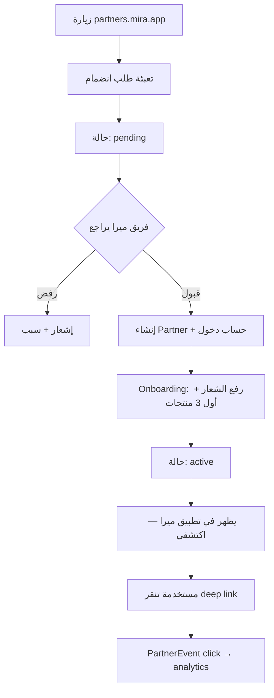

# partners.mira.app — مواصفات المنصة B2B

> **الهدف:** منصة ويب احترافية تخدم **ميرا** و**الشركاء** معاً — ليست «موقع تعريفي» فقط، بل **نظام تشغيل** للماركات والعيادات والصالونات.

---

## 1. من يستخدم المنصة؟

| الدور | الدومين | الوظيفة |
|-------|---------|---------|
| **شريك** (ماركة / عيادة / صالون) | `partners.mira.app` | إدارة الكتalog، متابعة الأداء، الحجوزات |
| **فريق ميرا** | `admin.mira.app` (لاحقاً) | اعتماد الشركاء، مراقبة، عمولات |
| **مستخدمة ميرا** | تطبيق Flutter | اكتشاف + توصيات + حجز (B2C — بدون دخول للبوابة) |

---

## 2. ماذا **نحتاج من الشريك** (بالضبط)

### 2.1 بيانات التسجيل والامتثال (إلزامي قبل التفعيل)

| الحقل | ماركة | عيادة | صالون | لماذا |
|-------|-------|-------|-------|-------|
| الاسم التجاري (عربي + إنجليزي) | ✓ | ✓ | ✓ | عرض في التطبيق |
| السجل التجاري / الترخيص | ✓ | ✓ | ✓ | امتثال قانوني |
| الرقم الضريبي (VAT) | ✓ | ✓ | ✓ | فواتير لاحقة |
| المدينة + الفروع | ✓ | ✓ | ✓ | مطابقة جغرافية |
| مسؤول حساب (اسم، جوال، بريد) | ✓ | ✓ | ✓ | تواصل + دخول البوابة |
| شعار + صور (PNG/SVG) | ✓ | ✓ | ✓ | واجهة احترافية |
| قبول اتفاقية الشراكة | ✓ | ✓ | ✓ | قانوني |
| رابط سياسة الإرجاع/الخصوصية | ✓ | ✓ | ✓ | ثقة المستخدمة |

### 2.2 ماركة تجميل — كتalog المنتجات

لكل **منتج** نحتاج:

| الحقل | مثال | ملاحظة |
|-------|------|--------|
| `nameAr` / `nameEn` | سيروم نياسيناميد | |
| `descriptionAr` | ترطيب + توحيد | |
| `priceHalalas` | 8900 (= 89 ر.س) | |
| `externalUrl` | رابط Salla/Zid | **الدفع عند الشريك** |
| `concernTags` | `moisture`, `pore`, `acne` | تطابق YouCam |
| `skinTypes` | `دهنية`, `مختلطة` | |
| `stepAr` | تنظيف / سيروم / مرطب | روتين |
| `imageUrl` | (v1.1) | حالياً emoji/logo |

**لا نحتاج:** مخزون حي، سلة، دفع — يبقى في متجر الشريك.

### 2.3 عيادة / صالون — كتalog الخدمات

لكل **خدمة** نحتاج:

| الحقل | مثال |
|-------|------|
| `nameAr` | جلسة فيشل تنظيف عميق |
| `durationMin` | 45 |
| `priceHalalas` | 35000 |
| `concernTags` | `acne`, `pore` |
| `bookingEnabled` | false → true عند تفعيل الحجز |
| `descriptionAr` | تفاصيل للمستخدمة |

**لاحقاً للحجز:** أيام/ساعات العمل، مدة buffer، إلغاء قبل X ساعة.

---

## 3. ماذا **يحتاج الشريك منا** (قيمة المنصة)

| احتياج الشريك | ماذا نقدّم في البوابة | الأولوية |
|---------------|----------------------|----------|
| «لماذا أنضم لميرا؟» | Landing + أرقام (مستخدمات، مطابقات) | v1 |
| تسجيل و onboarding | نموذج + تتبع حالة (قيد المراجعة → مفعّل) | v1 |
| إدارة المنتجات/الخدمات | CRUD كامل + معاينة كما تظهر في التطبيق | v1 |
| معرفة الأداء | لوحة: مشاهدات، نقرات deep link، top concerns | v1.1 |
| حجوزات/استفسارات | صندوق وارد + تأكيد/رفض | v2 |
| فواتير وعمولات | تقرير شهري + نسبة متفق عليها | v2 |
| دعم | تذكرة + مركز مساعدة | v1.1 |
| مزامنة تلقائية | CSV import أو API webhook (Salla) | v3 |

**مبدأ ذهبي:** الشريك يرى **إحصائيات مجمّعة** — **لا** بيانات شخصية لمستخدمات ميرا (لا emails، لا selfies).

---

## 4. وحدات partners.mira.app (الشاشات)

### المرحلة v1 — «تشغيل الكتalog» (4–6 أسابيع)

```
/partners.mira.app
├── /                    Landing B2B + «انضم كشريك»
├── /apply               طلب انضمام (→ WebsiteLead أو PartnerApplication)
├── /login               دخول (Firebase Auth أو email+OTP للشركاء)
├── /dashboard           ملخص: حالة الحساب، عدد منتجات/خدمات، نقرات
├── /catalog/products    CRUD منتجات (ماركات)
├── /catalog/services    CRUD خدمات (عيادات/صالونات)
├── /profile             بيانات الجهة + روابط المتجر
├── /help                دليل concern tags + أمثلة
└── /settings            فريق، إشعارات، كلمة مرور
```

### المرحلة v1.1 — «الشفافية»

- `/analytics` — رسوم: نقرات، مطابقات، concerns الأكثر
- `/support` — تذاكر

### المرحلة v2 — «الحجز والمال»

- `/bookings` — مواعيد من التطبيق
- `/calendar` — توفر (عيادات/صالونات)
- `/billing` — عمولات وفواتير

### admin.mira.app (فريق ميرا)

- `/applications` — قائمة طلبات + اعتماد/رفض
- `/partners` — كل الشركاء + suspend
- `/catalog-review` — مراجعة منتجات قبل النشر (اختياري)
- `/leads` — رسائل الموقع

---

## 5. الهندسة التقنية (مقترح)

```
partners.mira.app (Static/React أو Next.js على Render)
        │
        ▼
mira-api  /api/v1/partners-portal/*
        │
        ├── PostgreSQL (partners, products, services — موجود)
        ├── PartnerUser + PartnerApplication (جديد)
        ├── PartnerEvent (click/impression — جديد)
        └── Firebase Auth (partner role) أو JWT منفصل

تطبيق Flutter  →  /api/v1/marketplace/*  (قراءة عامة — موجود)
```

### جداول Prisma **مطلوبة** (إضافة)

| Model | الغرض |
|-------|--------|
| `PartnerUser` | `email`, `partnerId`, `role` (owner/staff) |
| `PartnerApplication` | طلب انضمام قبل إنشاء Partner |
| `PartnerEvent` | `type`: impression \| click \| booking_request |
| `Booking` | (v2) موعد، status، userId anonymized ref |

### API endpoints **مطلوبة** (partners-portal module)

| Method | Path | Auth |
|--------|------|------|
| POST | `/partners-portal/apply` | عام |
| GET | `/partners-portal/me` | شريك |
| PATCH | `/partners-portal/me/profile` | شريك |
| GET/POST/PATCH/DELETE | `/partners-portal/products` | شريك (ماركة) |
| GET/POST/PATCH/DELETE | `/partners-portal/services` | شريك (عيادة/صالون) |
| GET | `/partners-portal/analytics` | شريك |
| GET | `/admin/partners/applications` | admin |

---

## 6. تدفق الشريك من البداية للنهاية



---

## 7. ما هو **موجود اليوم** vs **المتبقي**

### موجود ✅

| البند | أين |
|-------|-----|
| Partner / Product / Service في DB | `prisma/schema.prisma` |
| Seed 3 ماركات + عيادات + صالونات | `marketplace.seed.ts` |
| مطابقة concerns → منتجات | `marketplace-matching.engine.ts` |
| API عام: partners, match | `/api/v1/marketplace/*` |
| عرض في Flutter: اكتشفي | `discover_hub_screen.dart` |
| طلب شراكة (بسيط) | `POST /website/leads` |
| مرجع HTML B2B | `docs/partners-ecosystem.html` |

### غير موجود ❌ (partners.mira.app)

| البند | الأولوية |
|-------|----------|
| دومين `partners.mira.app` + SSL | P0 |
| واجهة البوابة (Login + Dashboard + Catalog) | P0 |
| `PartnerUser` + auth للشركاء | P0 |
| `PartnerApplication` + workflow اعتماد | P0 |
| Admin اعتماد الطلبات | P0 |
| Analytics events + dashboard | P1 |
| Bookings + calendar | P2 |
| Billing / commissions | P2 |
| CSV import / Salla sync | P3 |

---

## 8. نموذج عمل (Business) — يجب اتفاقه قبل الإطلاق

| الموضوع | ماركة | عيادة/صالون |
|---------|-------|-------------|
| **الدفع** | عند الشريك (deep link) | عند الشريك أو داخل ميرا (v2) |
| **عمولة ميرا** | % على click أو CPA | % على حجز مؤكد |
| **SLA** | تحديث أسعار خلال 48h | تأكيد حجز خلال 2h |
| **جودة الكتalog** | concern tags صحيحة | أوصاف دقيقة |

---

## 9. checklist قبل أول شريك حقيقي

- [ ] اتفاقية شراكة PDF + checkbox في `/apply`
- [ ] دليل concern tags (YouCam ↔ ميرا)
- [ ] 3 منتجات حقيقية لكل ماركة + روابط متجر تعمل
- [ ] فريق ميرا يراجع قبل `status: active`
- [ ] `PERFECT_CORP` + marketplace يعمل في التطبيق
- [ ] privacy: لا PII في analytics للشريك

---

## 10. تقدير الجهد

| مرحلة | المدة | المخرج |
|-------|-------|--------|
| **v1 Portal** | 4–6 أسابيع | apply + login + catalog CRUD + admin approve |
| **v1.1 Analytics** | 2 أسابيع | clicks + dashboard |
| **v2 Booking** | 4–8 أسابيع | calendar + inbox |
| **v2 Billing** | 3–4 أسابيع | commissions report |

---

*آخر تحديث: يونيو 2026 · مرتبط بـ `mira-api/marketplace` + Flutter `features/marketplace`*
